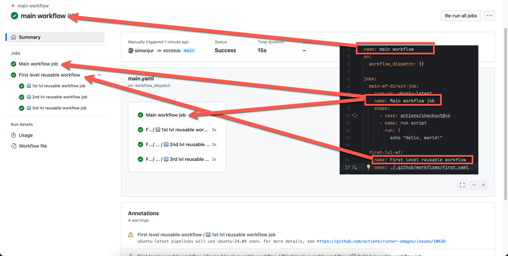

# reusable-wfs-vs-dispatching-examples
Examples of reusable workflows and dispatch events

- reusable workflow
 - max 3 levels

run id: https://github.com/simonjur/reusable-wfs-vs-dispatching-examples/actions/runs/12641365610

3 levels run:
https://github.com/simonjur/reusable-wfs-vs-dispatching-examples/actions/runs/12641414061

naming:

main wf names in WF run:

first level wf names: in WF run:

jobs naming:

 
jobs naming - explained:

|                                              | reusable workflows        | `workflow_dispatch`                | `repository_dispatch`              |
|----------------------------------------------|---------------------------|------------------------------------|------------------------------------|
| nesting and uniq. files limited              | yes 3 levels and 25 files | no                                 | no                                 |
| max. input params count limited              | no                        | yes 10                             | partially max. 10 top json keys    |
| max. input payload  limited                  | no                        | yes 64k                            | yes 64k                            |
| can have outputs                             | yes                       | no - use artifact                  | no - use artifact                  |
| visualised in gh run view                    | yes but limited           | no                                 | no                                 |
| cross repository calls                       | no                        | yes                                | yes                                |
| can run multiple wfs without explicit naming | no                        | no                                 | yes                                |
| full artifact access                         | yes                       | no needs permissions               | no needs permissions               |
| waiting for completion                       | yes                       | no - needs extra action and runner | no - needs extra action and runner |

- workflow dispatch
  - example with `workflow_dispatch` action 
 
- repository dispatch
  - example with command
  - example with running multiple wfs with one disaptch event
